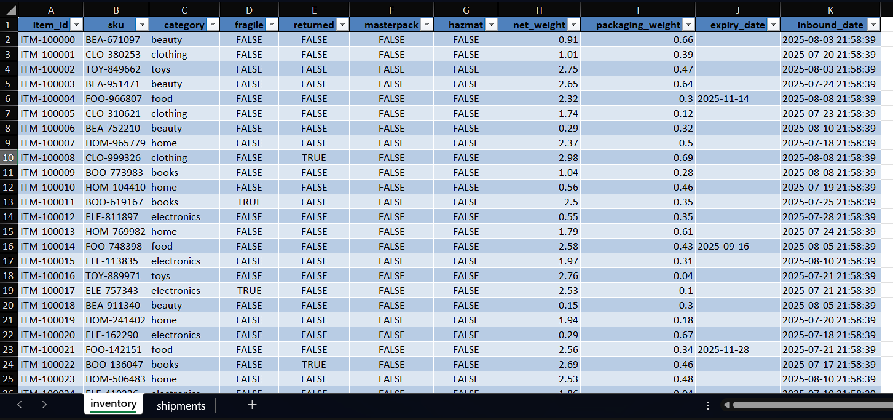
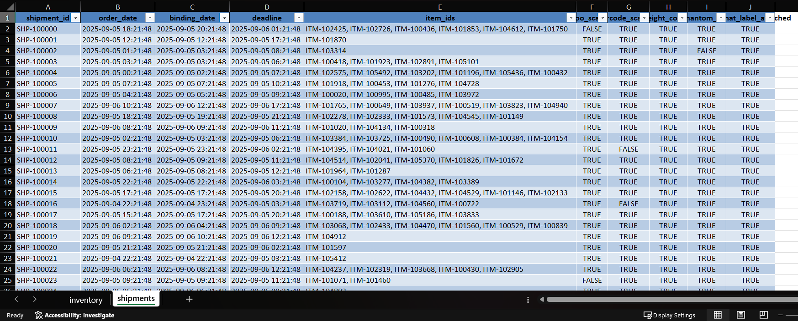
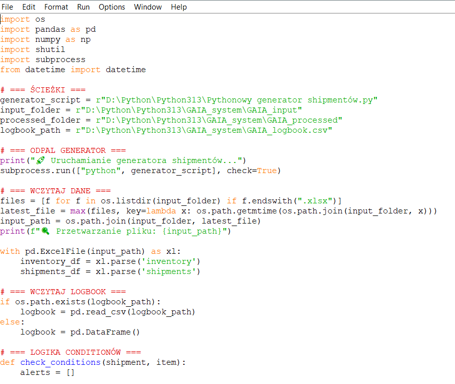
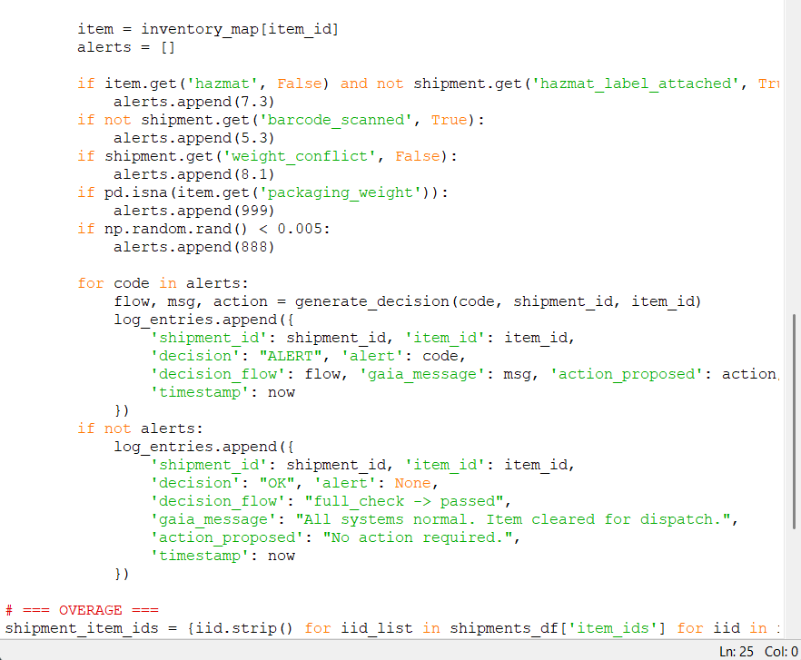
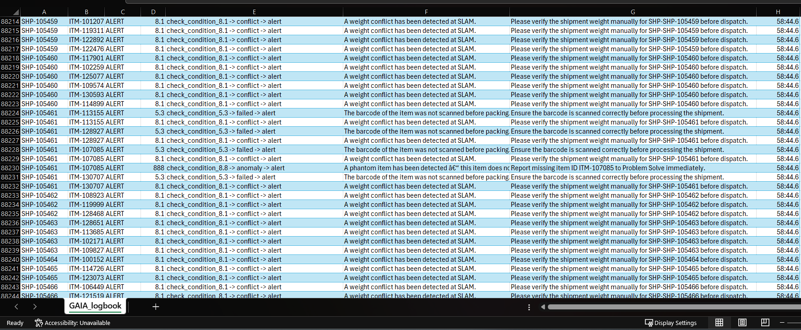
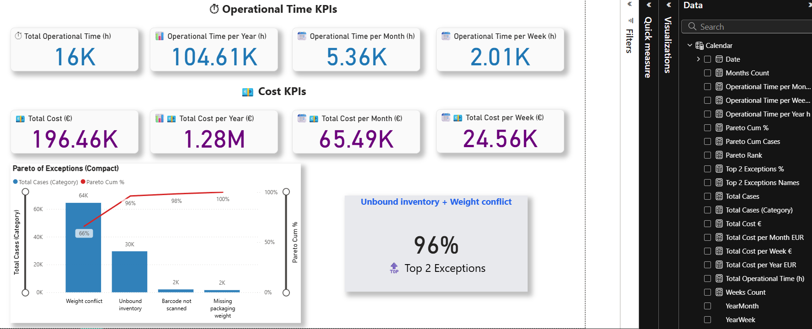

Portfolio showcasing projects in supply chain analytics, Excel, Power BI, SQL, and Six Sigma

# Operational Analytics Prototype (Python + Power BI)

 Duration: June 2025 – Present  

##  Description
This project is a prototype analytics system designed to monitor and evaluate **operational anomalies in logistics workflows**.  
It demonstrates how data, algorithms, and visualization can be combined to support **supply chain exception handling**.

The solution combines:
-  **Python** – backend scripts for anomaly detection and decision-making,  
-  **Excel/CSV datasets** – synthetic inventory & shipment data for simulation,  
-  **Power BI** – interactive dashboards for KPI monitoring and Pareto analysis,  
-  **Lean Six Sigma** – methodology for process improvement and waste reduction.  

---

##  Components

### 1. Dataset (Inventory & Shipments)
Synthetic dataset for testing anomaly detection logic.  
Includes categories, SKUs, weights, expiry dates, fragile/hazmat flags.  
  
  

---

### 2. Python Scripts
Two Python scripts form the backend "decision engine".  
They evaluate each shipment against conditions such as hazmat labels, barcode scans, weight conflicts, and packaging completeness.  

Example anomaly checks:
- Hazardous material without proper label,  
- Missing barcode scan,  
- Weight conflict at SLAM,  
- Phantom or missing items,  
- Incomplete packaging weight.  

  
  

---

### 3. Logbook
The system generates a **logbook** of all decisions, creating full traceability for each shipment.  
Log entries include:  
- Shipment ID, Item ID,  
- Condition checks and results,  
- Alert messages,  
- Operator instructions.  

  

---

### 4. Power BI Dashboard
Interactive Power BI dashboard visualizes operational and cost KPIs:  
- Total operational time and cost (weekly, monthly, yearly),  
- Pareto analysis of exception categories,  
- Highlight of top 2 exception drivers (~96% of cases).  

  

---

##  Key Outcomes
✅ Identified critical bottlenecks (weight conflict, unbound inventory),  
✅ Quantified operational and financial impact (hours & €),  
✅ Demonstrated how to focus improvement efforts using the Pareto principle,  
✅ Created a scalable framework for exception handling in supply chains.  

---

##  Skills Demonstrated
- **Supply Chain Analytics**  
- **Lean Six Sigma** (DMAIC, Pareto, Waste reduction)  
- **Python (Pandas, NumPy)** – data processing & anomaly detection  
- **Power BI** – KPI dashboards & data storytelling  
- **Excel** – dataset preparation & validation  
